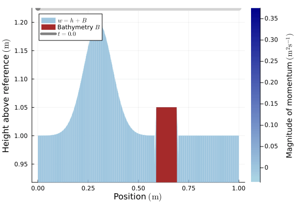

# Homemade Conslaws

This is a package in Julia written for my specialization project during the last year of my master's degree in applied physics and mathematics at NTNU. The project aims to get an intuition about conservation laws and their numerical finite volume (FVM) solutions. Furthermore, a FVM solver inspired by SINTEF Digital's solver, [`SinFVM.jl`](https://github.com/sintefmath/SinFVM.jl) (previously `SinSWE.jl`) is implemented in order to investigate computational difficulties with shallow water simulations.

One of these problems can be seen in the following animation:

The CFL-condition may in some situations severilly restrict the time step size, potentially making the simulation very slow. This and other problems are describe din detail in the final report, which can be found [here](https://martinsw01.github.io/homemade-conslaws/dev/final_report).

<!-- SINTEFs approach makes the solver very general and flexible. One may choose between different numerical fluxes, limiters, time integrators, equations, and boundary conditions, which one may easily implement themselves. Further, it is meant to run in parallel on the GPU, which is outside the scope of this project. -->

